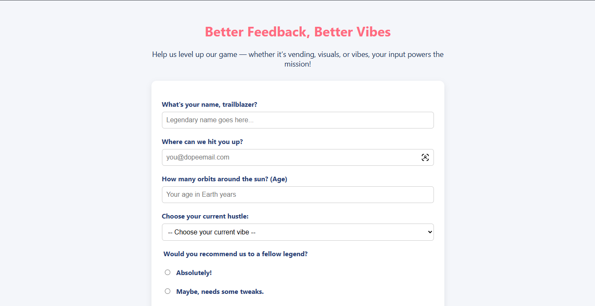

# Better Feedback Survey Form

A fully responsive survey form built with semantic HTML and modern CSS.  
Designed to collect structured feedback from creators, builders, and entrepreneurs while demonstrating accessible form architecture and clean UI design.

## Live Demo
https://sharpsanders.github.io/survey-form/



---

## Overview

This project fulfills the freeCodeCamp **Survey Form** certification requirements, with custom copy and branding aligned to the Better Endeavors identity.

The form includes:

- Page title and descriptive header
- Required and optional input fields
- Grouped radio and checkbox inputs
- Accessible labels and fieldsets
- Responsive layout optimized for mobile and desktop

No JavaScript is used in this version. The focus is on semantic structure, accessibility, and clean visual hierarchy.

---

## Form Structure

### Required Inputs
- **Name**  
  `type="text"` — required  
  `id="name"`

- **Email**  
  `type="email"` — required  
  `id="email"`

### Optional Input
- **Age**  
  `type="number"`  
  `min="13"`  
  `max="100"`  
  `id="number"`

### Select Dropdown
- Role / Current Hustle (`id="dropdown"`)
  - Student
  - Freelancer
  - Startup / Creator
  - Other

### Recommendation (Radio Group)
- Absolutely
- Maybe, needs improvement
- Not currently

### Interests (Checkbox Group)
- Vending & Passive Income
- Web Development & SaaS
- Gaming & Streaming
- Branding & Strategy

### Open Feedback
- `<textarea id="comments">`

Grouped questions use proper `fieldset` and `legend` elements for improved accessibility and semantic clarity.

---

## Styling Approach

Core styles are defined in `styles.css`.

Design principles applied:

- Centered layout with `max-width: 700px`
- Neutral background with elevated white card
- Soft drop shadow and rounded corners
- Clean system font stack (Segoe UI)
- Consistent spacing and visual rhythm

Accent colors:
- Heading: `#FF6B81`
- Label text: `#243B73`
- Primary button: `#FFD93D`
- Button hover: `#00C2D1`

Inputs and textareas are full-width with consistent padding and border-radius for usability and clarity.

---

## Technical Focus

This project demonstrates:

- Semantic HTML form structure
- Proper label-to-input associations
- Use of `fieldset` and `legend` for grouped inputs
- Native browser validation using `required`, `min`, `max`, and `type="email"`
- Mobile-first responsive layout
- Clean separation between structure and presentation

---

## Project Structure

```text
survey-form/
├── index.html
└── styles.css
Running Locally
Clone the repository

Open index.html in your browser

No build tools or dependencies required.

Future Enhancements
Add client-side validation feedback

Integrate with a backend or form service (Netlify Forms, Formspree, etc.)

Add submission confirmation state

Conditional “Other” input field logic

Subtle UI transitions for improved UX

Author
Created by Trevyn Sanders
Better Endeavors LLC